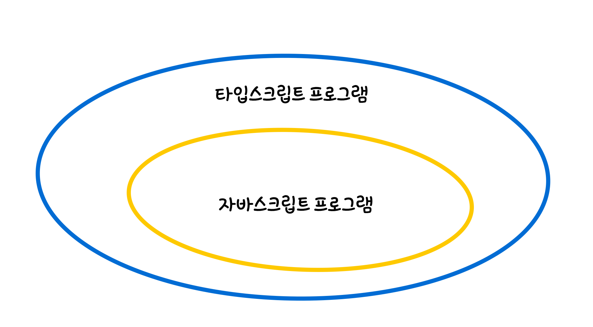
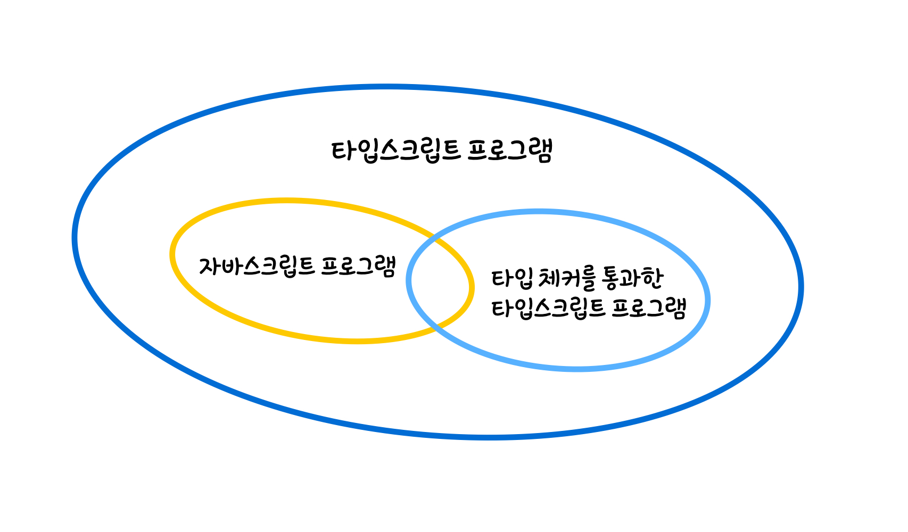

# 타입스크립트와 자바스크립트의 관계 이해하기

> ## 타입스크립트는 자바스크립트의 상위집합(superset)입니다

 </br>

다음 코드는 자바스크립트이자 타입스크립트 코드입니다.

```jsx
function greet(who)) {
 console.log("Hello", who);
}
```

그러나, who로 받고있는 인자 옆에 `: string` 을 추가한 뒤, 자바스크립트 프로그램에서 코드를 실행하면 오류가 납니다. 타입 구문이 추가된 타입스크립트 코드이기 때문입니다.

```jsx
function greet(who: string) {
	console.log("Hello", who);
}
```

즉, 모든 자바스크립트는 타입스크립트이지만 모든 타입스크립트가 자바스크립트는 아닙니다.



</br>
</br>

> ## 타입스크립트는 런타임에 오류를 발생시키는 코드를 찾아내려고 합니다

</br>

타입스크립트 프로그램의 타입체커는 states 배열내의 capital과 for-of문의 capitol의 스펠링이 다르다는 것을 런타임에 찾아냅니다. 그리고 해결책까지 제시합니다.

```jsx
export const foo = true;
const states = [
	{ name: "Alabama", capital: "Montgomery" },
	{ name: "Alaska", capital: "Juneau" },
	{ name: "Arizona", capital: "Phoenix" },
	// ...
];

for (const state of states) {
	console.log(state.capitol);
	// ~~~~~~~  'capitol' 속성이  '{ name: string; capital: string; }' 형식에 없습니다.
	//         'capital'을(를) 사용하시겠습니까?
}
```

</br>
</br>

> ## 타입스크립트는 타입 구문 없이도 오류를 잡을 수 있지만, 타입 구문을 추가한다면 훨씬 더 많은 오류를 찾아낼 수 있습니다

</br>
이번에는 states 배열 내에 오타를 내어 capitol이라 적고, for-of문에 올바른 스펠링인 capital을 적어보겠습니다. 역시나 스펠링이 달라 타입체커가 오류를 찾아냈습니다. 그러나 해결책이 잘못되었습니다. capitol이 아니라 capital이 맞으니까요. 이렇듯 타입체커는 오류의 원인을 추측하지만 항상 정확하지는 않습니다.

```jsx
const states = [
	{ name: "Alabama", capitol: "Montgomery" },
	{ name: "Alaska", capitol: "Juneau" },
	{ name: "Arizona", capitol: "Phoenix" },
	// ...
];
for (const state of states) {
	console.log(state.capital);
	// ~~~~~~~  'capital' 속성이  '{ name: string; capitol: string; }' 형식에 없습니다.
	//         'capitol'을(를) 사용하시겠습니까?
}
```

타입체커가 정확한 해결책을 제시하도록 interface문을 사용하여 states의 타입을 명시적으로 선언해줍시다. 이제 타입체커는 런타임에 오류를 발생시킬 뿐만아니라 정확한 해결책까지 제시합니다.

```jsx
interface State {
	name: string;
	capital: string;
}
const states: State[] = [
	{ name: "Alabama", capitol: "Montgomery" },
	// ~~~~~~~~~~~~~~~~~~~~~
	{ name: "Alaska", capitol: "Juneau" },
	// ~~~~~~~~~~~~~~~~~
	{ name: "Arizona", capitol: "Phoenix" },
	// ~~~~~~~~~~~~~~~~~~ 개체 리터럴은 알려진 속성만 지정할 수 있지만
	//                    'State'형식에 'capitol'이(가)없습니다.
	//                    'capital'을(를)쓰려고 했습니까?
	// ...
];
for (const state of states) {
	console.log(state.capital);
}
```

모든 자바스크립트는 타입스크립트이지만, 일부 자바스크립트(그리고 타입스크립트)만이 타입체크를 통과합니다.


</br>

> ## 타입스크립트의 타입시스템은 자바스크립트의 런타임 동작을 '모델링'합니다

</br>

아래 코드들은 모두 자바스크립트 프로그램에서 런타임 오류 없이 실행됩니다. 그러나 타입스크립트 프로그램에서는 런타임 오류가 나기도, 안나기도 합니다.

</br>

변수 x는 런타임 오류없이 "23" 값을 가집니다.

```jsx
const x = 2 + "3"; // 정상, string 타입입니다.
```

반면에, 변수 a, b 그리고 alert("Hello", "TypeScript")은 타입체커에 걸려 런타임 오류를 냅니다.

```jsx
const a = null + 7; // 자바스크립트에서는 a값이 7이 됩니다.
// ~~~~ Operator '+' cannot be applied to types ...
const b = [] + 12; // 자바스크립트에서는 b값이 '12'가 됩니다.
// ~~~~~~~ Operator '+' cannot be applied to types ...
alert("Hello", "TypeScript"); // 자바스크립트에서는 "Hello"경고를 표시합니다.
// ~~~~~~~~~~~~ Expected 0-1 arguments, but got 2
```

</br>

이처럼 타입시스템이 자바스크립트 런타임 동작을 그대로 모델링할지, 또는 추가적인 타입체크를 할지 분명하게 알 수 없어 타입스크립트 사용에대한 의문이 들 수 있습니다. 타입스크립트 채택 여부는 온전히 우리의 선택에 달렸습니다. 분명한것은 타입스크립트의 도움을 받으면 오류가 적은 코드를 작성할 수 있다는 것입니다.

</br>

## 요약

- 타입스크립트는 자바스크립트의 상위집합(superset)입니다.
- 타입스크립트는 런타임에 오류를 발생시키는 코드를 찾아내려고 합니다.
- 타입스크립트는 타입 구문 없이도 오류를 잡을 수 있지만, 타입 구문을 추가한다면 훨씬 더 많은 오류를 찾아낼 수 있습니다.
- 타입스크립트의 타입시스템은 자바스크립트의 런타임 동작을 '모델링'합니다.
