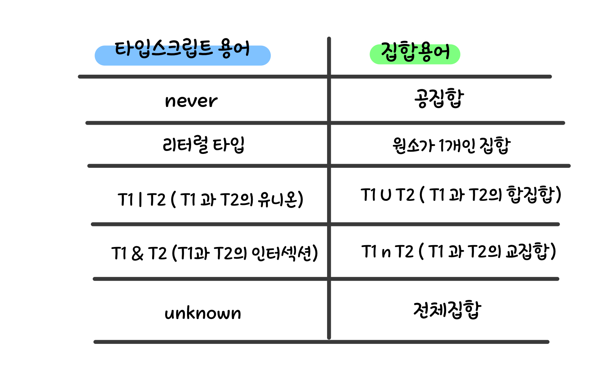

# 타입이 값들의 집합이라고 생각하기

## never

아무 값도 포함하지 않는 가장 작은 집합은 공집합으로, 타입스크립트에서는 never 타입입니다.

```js
const x: never = 12;
// ~ Type '12' is not assignable to type 'never'
```

</br>

## 유닛(uinit)타입 혹은 리터럴(literal)타입

한가지 값만 포함하는 타입입니다.

```js
type A = "A";
type B = "B";
type Twelve = 12;
```

</br>

## 유니온(uinion)타입

값을 두 개 혹은 세 개로 묶은, 값들의 합집합입니다.

```js
type AB = "A" | "B";
type AB12 = "A" | "B" | 12;
const a: AB = "A"; // OK, value 'A' is a member of the set {'A', 'B'}
const c: AB = "C";
// ~ Type '"C"' is not assignable to type 'AB'
```

## 인터섹션(intersection)

인터섹션은 &연산자를 사용하여 두 타입의 교집합을 나타냅니다.
Person과 Lifespan 인터페이스는 공통으로 가지는 속성이 없기 때문에 PersonSpan이 공집합(nerver타입)이라고 예상할 수 있지만, 타입은 인터페이스 속성이 아닌 값의 집합에 적용이 됩니다. 그래서 Person과 Lifespan을 둘 다 가지는 값이 인터섹션 타입에 속하게 됩니다.

따라서, 아래 예시에서 ps 객체에 name 혹은 birth가 없으면 두 인터페이스 값을 모두 갖지 못함으로 오류가 납니다. 추가로 Person과 Lifespan 인터페이스를 유니온 타입으로 묶으면 타입은 never가 됩니다.

```js
interface Person {
	name: string;
}
interface Lifespan {
	birth: Date;
	death?: Date;
}
type PersonSpan = Person & Lifespan;

const ps: PersonSpan = {
	name: "Alan Turing",
	birth: new Date("1912/06/23"),
	death: new Date("1954/06/07"),
}; // OK

type K = keyof (Person | Lifespan);  // Type is never
```

## 요약


